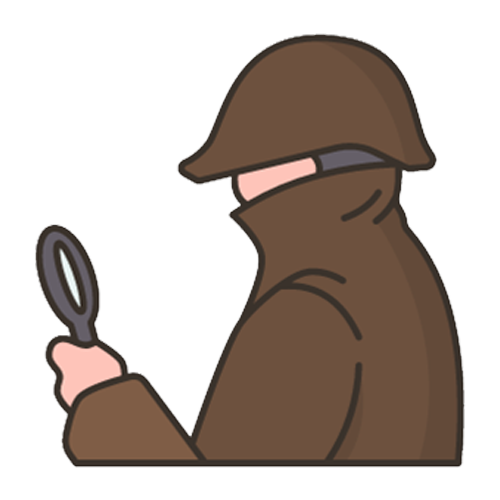
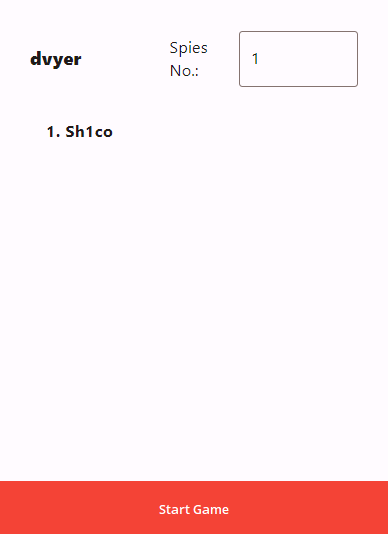
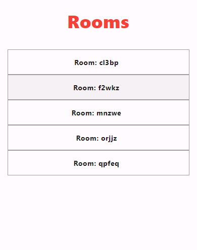
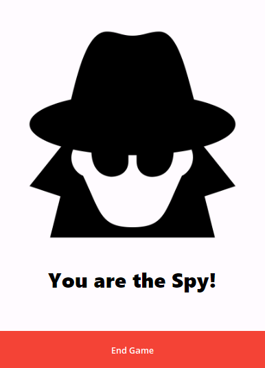
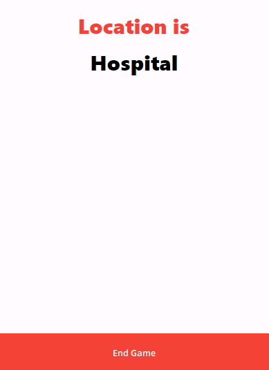

<a name="readme-top"></a>

<br />
<div align="center">
  <a href="https://github.com/Sh1co/SpyFall-Telegram-Miniapp">
    
  </a>

<h3 align="center">SpyFall</h3>

  <p align="center">
    Experience the thrill of espionage with our Telegram webapp, where you can play Spyfall and test your undercover skills with friends!
    <br />
    <a href="https://github.com/Sh1co/SpyFall-Telegram-Miniapp"><strong>Explore the docs »</strong></a>
    <br />
    <br />
    <a href="https://t.me/sh1co_test_bot/spyfall">View Demo</a>
    ·
    <a href="https://github.com/Sh1co/SpyFall-Telegram-Miniapp/issues">Report Bug</a>
    ·
    <a href="https://github.com/Sh1co/SpyFall-Telegram-Miniapp/issues">Request Feature</a>
  </p>
</div>

<!-- TABLE OF CONTENTS -->
<details>
  <summary>Table of Contents</summary>
  <ol>
    <li>
      <a href="#about-the-project">About The Project</a>
      <ul>
        <li><a href="#built-with">Built With</a></li>
      </ul>
    </li>
    <li>
      <a href="#getting-started">Getting Started</a>
      <ul>
        <li><a href="#prerequisites">Prerequisites</a></li>
        <li><a href="#running">Running</a></li>
      </ul>
    </li>
    <li><a href="#usage">Usage</a></li>
    <li><a href="#roadmap">Roadmap</a></li>
    <li><a href="#contributing">Contributing</a></li>
    <li><a href="#license">License</a></li>
    <li><a href="#contact">Contact</a></li>
  </ol>
</details>

<!-- ABOUT THE PROJECT -->
## About The Project

Spyfall is an engaging social deduction game in which participants are tasked with either uncovering the hidden spy among them or, if they happen to be the spy, deducing the secret location without arousing suspicion.

In this project, our aim is to introduce the Spyfall experience, as found on [spyfall.app](https://spyfall.app), to the Telegram platform by harnessing the power of Telegram's miniapps.

### Objective

The primary objective of this endeavor is to showcase the application of Flutter and soar quest in the creation of room-based multiplayer games within the Telegram MiniApps environment.

[![Product Name Screen Shot][product-screenshot]](https://t.me/sh1co_test_bot/spyfall)

<p align="right">(<a href="#readme-top">back to top</a>)</p>

### Built With

* [Telegram](https://telegram.org)
* [Soar Quest](https://soar.quest)
* [Flutter](https://flutter.dev)
* [Firebase](https://firebase.google.com)

<p align="right">(<a href="#readme-top">back to top</a>)</p>

<!-- GETTING STARTED -->
## Getting Started

To experience the game, you have two options. You can either play it through the Telegram web app by visiting [t.me/sh1co_test_bot/spyfall](https://t.me/sh1co_test_bot/spyfall), or you can set it up locally and try it with your own bot by following the steps below

### Prerequisites

To run the game locally make sure you have the following:

* Flutter version 3.13.6 or higher
* ngrok or any similar service

### Running

1. Clone the repo

   ```sh
   git clone https://github.com/Sh1co/SpyFall-Telegram-Miniapp.git
   ```

2. Install pub dev packages

   ```sh
   flutter pub get
   ```

3. Run the flutter web server

   ```sh
   flutter run -d web-server --web-renderer html --web-port 8080
   ```

4. Run ngrok or whatever service you are using

   ```sh
   ngrok http <your domain> 8080
   ```

5. Create a new bot on Telegram's [bot father](https://t.me/BotFather)

6. Create a new webapp for your new bot on bot father and give it your webserver domain (ngrok domain).

<p align="right">(<a href="#readme-top">back to top</a>)</p>

<!-- USAGE EXAMPLES -->
## Usage

To play the game first you do the following:

1. Create a room.



2. Ask your friends to find your room in the room list



3. Start game!

 

* If you don't know how to play spyfall you can check the How to Play section in the game.

<p align="right">(<a href="#readme-top">back to top</a>)</p>

<!-- ROADMAP -->
## Roadmap

* [X] Base spyfall gameplay
* [X] Rooms Browser
* [X] Custom spy count
* [X] Post game preview
* [ ] Direct join to room

<p align="right">(<a href="#readme-top">back to top</a>)</p>

<!-- CONTRIBUTING -->
## Contributing

Contributions are what make the open source community such an amazing place to learn, inspire, and create. Any contributions you make are **greatly appreciated**.

If you have a suggestion that would make this better, please fork the repo and create a pull request. You can also simply open an issue with the tag "enhancement".
Don't forget to give the project a star! Thanks again!

1. Fork the Project
2. Create your Feature Branch (`git checkout -b feature/AmazingFeature`)
3. Commit your Changes (`git commit -m 'Add some AmazingFeature'`)
4. Push to the Branch (`git push origin feature/AmazingFeature`)
5. Open a Pull Request

<p align="right">(<a href="#readme-top">back to top</a>)</p>

<!-- LICENSE -->
## License

Distributed under the MIT License. See `LICENSE.txt` for more information.

<p align="right">(<a href="#readme-top">back to top</a>)</p>

<!-- CONTACT -->
## Contact

Sh1co - <<<s.nafee@innopolis.university>>>

Project Link: [https://github.com/Sh1co/SpyFall-Telegram-Miniapp](https://github.com/Sh1co/SpyFall-Telegram-Miniapp)

<p align="right">(<a href="#readme-top">back to top</a>)</p>

<!-- ACKNOWLEDGMENTS
## Acknowledgments

* []()
* []()
* []()

<p align="right">(<a href="#readme-top">back to top</a>)</p> -->

<!-- MARKDOWN LINKS & IMAGES -->
<!-- https://www.markdownguide.org/basic-syntax/#reference-style-links -->
[product-screenshot]: images/screenshot.png
